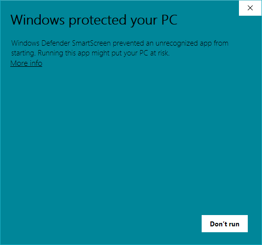

# CClose

CClose is a Windows utility written in [AutoHotkey](https://autohotkey.com/). It helps you close windows faster and easier.  
(Bonus: It also allows you to pin windows always on top.)

 

## All Features

| Action          | + Target         | = Result                         |
| :-------------- | :--------------- | :------------------------------- |
| Middle click    | + title bar      | = close window                   |
| Right click     | + title bar      | = minimize window                |
| Hold left click | + title bar      | = toggle window always on top    |
| Double press    | + Esc key        | = close active window            |
| Right click     | + taskbar button | = move pointer to "Close window" |

## Download
You can download the installer `CClose Setup.exe` [here](https://github.com/chaohershi/cclose/releases).

**Please be aware that you may get a popup message from Windows SmartScreen when running the installer.** The message would state that "Windows Defender SmartScreen prevented an unrecognized app from starting." This is totally normal. It takes some time for a new certificate, like the one that CClose is using, to get recognized. Nevertheless, CClose is free and minimal and contains no malware of any kind. Feel free to do a virus scan if you are worried!

To run CClose from Windows SmartScreen, click on the "More info" link and then click on the "Run anyway" button.  

## Donate
If you enjoy using CClose, you can buy me a cup of coffee. :) I would really appreciate your support.

<table>
  <tbody>
    <tr>
      <td> Alipay</td>
      <td> WeChat</td>
      <td> PayPal</td>
    </tr>
    <tr>
      <td></td>
      <td></td>
      <td></td>
    </tr>
  </tbody>
</table>

[Donation List](https://github.com/chaohershi/cclose/wiki/Donation)

## License
CClose is available under the MIT License.  
CClose icon made by [Pavel Kozlov](https://www.flaticon.com/authors/pavel-kozlov) from [Flaticon](https://www.flaticon.com/free-icon/delete-button_70287) is licensed by [CC 3.0 BY](https://creativecommons.org/licenses/by/3.0/).
