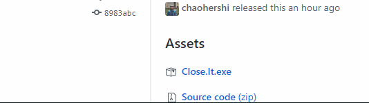

Close It is a Windows utility written in [AutoHotkey](https://autohotkey.com/). It helps you close windows faster and easier.  
(Bonus: It also allows you to pin windows always on top.)

 

## All Features ##
- Middle click + title bar = close window.
- Right click + title bar = minize window.
- Hold left click + title bar = toggle window always on top.
- Double press + Esc key = close active window.
- Right click + taskbar button = pointer moves to "Close window".

## Download ##
You can download the installer `Close It Setup.exe` [here](https://github.com/chaohershi/Close-It/releases).

**Please be aware that if you choose to download and run the executable, you may get warnings from your web browser and Windows SmartScreen.** This is totally normal. It takes some time for a new certificate, like the one that Close It is using, to get recognized. Nevertheless, Close It is free and minimal and contains no malware of any kind. Feel free to do a virus scan if you are still worried!

To save Close It from Chrome, click on the up arrow and select "Keep".  

To run Close It from Windows SmartScreen, click on the "More info" link and then click on the "Run anyway" button.  

## License ##
Close It is available under the MIT License.  
Close It icon made by [Pavel Kozlov](https://www.flaticon.com/authors/pavel-kozlov) from [Flaticon](https://www.flaticon.com/free-icon/delete-button_70287) is licensed by [CC 3.0 BY](https://creativecommons.org/licenses/by/3.0/).
